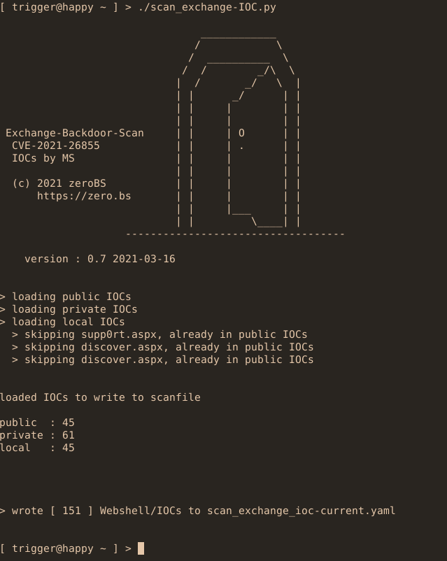

# Readme

a script to generate a YAML-Scan-file (nuclei-template) for 
[nuclei-scanner](https://github.com/projectdiscovery/nuclei) 
based on [IOCs released by Microsoft](https://twitter.com/tanmayg/status/1369125158481399809)
on observed Webshells.

the scanfile will detect implanted webshells, if known so far as IOC, or given as
private IOCs, and can update the scanfile if new IOCs are found

workflow is as follows:

- Download a internet-wide search for OWA-hosts
- generate a current nuclei-template-file with `scan_exchange-IOC.py`:
    - this willdownload the current IOC-json from Micrsosoft
    - then generate nuclei-template file called `scan_exchange_ioc-current.yaml` (a backup is safed on each run in `scan_exchange_ioc-$TIMESTAMP.yaml`

- scan your hosts with nuclei and your template 
- if you want to check for new IOCs later, just re_run `scan_exchange-IOC.py` ; if there a new IOCs to be found, a new `scan_exchange_ioc-current.yaml`
  file is generated; if no new IOCs, the script will exit
  

using private IOCs additionally:
- place a file called "private.iocs" into this directory
- put one webshell.aspx on each line; if the path does not contain a "/",  pathes will get expanded to well-known locations, e.g.
    - {{BaseURL}}/aspnet_client/webshell.aspx
    - {{BaseURL}}/owa/auth/webshell.aspx
- if the path contains a "/" liek owa/auth/yourprivatewebshell.aspx, this path will be taken as path beneath `{{BaseURL}}`

- check your `scan_exchange_ioc-current.yaml` - in the section below comment 
  # private_iocs
- please not: a check for new IOCs online will be skipped (as of v0.4), thus each time a new scan_template is generated 

example:

~~~
# private.iocs

shellA.aspx
ShellB.aspx
DssQQ21.aspx

~~~
  

scan in action:

# Changelog

v0.4 2021-03-12 
  - generate new scan_file only if new IOCs found
  - use private IOCs for private scans (skipping the check for new IOCs)
  

v0.2 2021-03-10 
  - first hackish version
  - first bugs fixed
