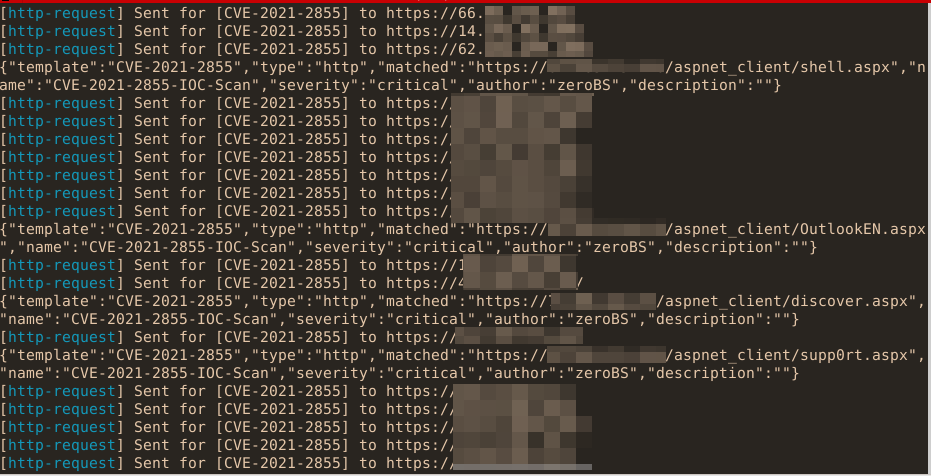

# Readme

a script to generate a YAML-Scan-file (nuclei-template) for 
[nuclei-scanner](https://github.com/projectdiscovery/nuclei) 
based on [IOCs released by Microsoft](https://twitter.com/tanmayg/status/1369125158481399809)
on observed Webshells.

the scanfile will detect implanted webshells, if known so far as IOC,  
and can update the scanfile if new IOCs are found

workflow is as follows:

- Download a internet-wide search for OWA-hosts
- generate a current nuclei-template-file with `scan_exchange-IOC.py`:
    - this willdownload the current IOC-json from Micrsosoft
    - then generate nuclei-template file called scan_exchange_ioc-current.yaml and scan_exchange_ioc-$TIMESTAMP.yaml 
- scan your hosts with nuclei and 

scan in action:

